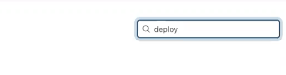

# Jenkins

This guide goes over the process of deploying jenkins on an ec2 instance.

## Index
1. Pre-Req
2. Setting up 1st EC2
3. Setting up 2nd EC2
4. Setting up Jenkins

## Pre-Req
### Thing That Will Be Helpful to Know

#### Bash Commands

- `sudo`  -
  - `su` - makes you root user
- `cp` - copy
  - `-r`
- `find` - find ie `find / -name context.xml`
- `cat` - 
- `mv` - rename
- `vi` - open in vim

#### Docker Commands
- Note because docker is run through ec2 you might have to run these commands with  sudo for example `sudo docker ps`
- `docker ps` - show the current running **containers**
- `docker pull` - retrives the image of dependency
- `docker run` -
  - `-d` - detached
  - `-p` - port - i.e `-p 8080:8080`
  - `--name` - name of the container
- `docker exec` -
  - `-u` - 0 for root user i.e `docker exec -u  0`
- `docker stop {container id}`  - kills container i.e `docker stop 05ce7bcf61d3`

### Vim
In vim you can be in either edit mode, read mode

- `i` - enter edit mode
  - while in edit mode
    - `esc` - exit edit mode
- `:q` -  to quit
- `:wq` - save and quit

---
## Setting Up First EC2

### Step 1 Create An EC2

You can find a guide to create an ec2 instance [here](https://github.com/220516-Java-Angular-Enterprise/ec2-guide)

Note: for step 6 you need to add a tcp port
to 8080 so that step is not optional.

SSH into EC2 Instance
 
run `sudo yum update` 

### Step 2 Install JDK 8
video reference (27:26)

run `sudo yum install java-1.8.0-openjdk`

check if was successful with `java -version`

### Step 3 Download Tomcat in EC22
33.00 mins left (week 5 day 5)

copy  link of tar.gz version you want (I will use 8.5)

run `sudo wget "link"`

`sudo wget https://dlcdn.apache.org/tomcat/tomcat-8/v8.5.81/bin/apache-tomcat-8.5.81.tar.gz`

Then you run

`sudo tar -zxvf {file name}`

`sudo tar -zxvf apache-tomcat-8.5.81.tar.gz`

remove tar.gz

`sudo -rf {filename}`

`sudo -rf  apache-tomcat-8.5.81.tar.gz`

rename to tomcat

#### Optional Rename File to tomcat

I will rename the directory to tomcat. Please note that some
future commands will be based on this directory change.

`mv {filename} tomcat`

`mv apache-tomcat-8.5.81/ tomcat`

### Step 4 Edit the Tomcat XML

To edit these xml in the ec2 we need to use vim. Please refer
to the ... for help.

#### Step 4.1 Edit tomcat-users.xml
Open tomcat-users.xml in vim

`vi /opt/tomcat/conf/tomcat-users.xml`

insert this code in the `<tomcat-user>` tag
```XML
<role rolename="manager-gui"/>
<role rolename="manager-script"/>
<role rolename="manager-status"/>
<role rolename="manager-jmx"/>
<user username="admin" password="revature" roles="manager-gui,manager-script,manager-status,manager-jmx"/>
<user username="maven-tomcat" password="revature" roles="manager-script"/>
```
How to do
> press `i` key (this will bring you to vim edit mode)

Save and Quit Out of Vim

How to Do 
  > 
  > press `esc` key
  > 
  > type `:wq`
  > 
  > press `enter` key

(find / -name context.xml) - might not be neccessary

#### Step 4.2 Edit context.xml in host-managers

`vi /opt/tomcat/weapps/host-manager/META-INF/context.xml`

comment line out that has the Valve namespace


save and quit out of vim

#### Step 4.3 Edit context.xml in managers

`vi /opt/tomcat/weapps/manager/META-INF/context.xml`

comment line out that has the Valve namespace

save and quit out of vim

### Random Tomcat info

to get cat log ssh into tomcat ec2

cd to tomcat/logs

---
## Setting Setting up 2nd EC2

### Step 5 Create EC2 For Jenkins 

same process as Step 1 just name this instance `jenkins`

### Step 6 Install Docker

run `sudo yum install docker` and type `y`.

### Step 7 Start Docker

run `sudo service docker `

### Step 8 Pull Jenkins to Docker

run `sudo pull jenkins/jenkins:lts`

### Step 9 Run Jenkins

run `docker run -d -p 8080:8080 --name jenkins-server jenkins/jenkins:lts`


### Step 10 Get Jenkins Pass
ssh into docker and jenken

run `docker exec -u 0 -it jenkins-server bash`

run `cat /var/jenkins_home/secrets/initialAdminPassword`

copy pass and login

---
## Setting Up Jenkins
(57:00 mins)

### Step 11 Select `Install suggested plugins`


### Step 12 Add User Data
(email and full name is not validated so you can add pusedo info)


### Step 13 Confirm Jenkins Url
You can keep this defualt (It should be you ec2 instance and the port jenkins is on)


---
## Using Jenkins to Deploy Your WAR

### Step 14 Install Deploy Plug-In
We need to install the deploy plugin so first

click `Mange Jenkins`


click `Manage Plugins`


search `deploy`



click  `Available`


select `Deploy to container`


click `Install without restart`


### Step 14 Click `New Item`
#### Pre-req

##### 15.1.1

Get git hup url where war file is hosted


##### 15.1.2

Get url of the tomcat you hosted in the Setting Up First EC2 Section


#### Creating a New Item
Get the url of the repository you war file is hosted


Create name for your demo and select `Freestyle project`


In `Source Code Mangement` select git and paste the url of step 15.1.1


In `Branch Specifier` put the branch name where your war file is located for this demo the war file was in the `deploy` branch


Select `Delete workspace before build starts` in `Build Environment`


Select `Deploy war/ear to a container`


In  `War/EAR files` type `**/*.war`


In `Context path` Type the name of the app


In `Containers` add your version of Tomcat


Click `Add` in `Credentials`


Add your Tomcat credentials in the `users.xml` (for example **Username:** admin **Password:** revature)


Enter Tomcat Url from your instance (Step 15.1.2)


You can now click `Apply` and `Save`

In the next screen click `Build Now`


And Hopefully you build is successful


---

### Hai's fix of jenkins not being able to read db.properties

(Need to implement)

---
## Tomcat In Docker (Optional)

This goes over installing a Tomcat image in docker. This was giving Bao issues so
we dont go further after dowloading the image.

### Install Docker

run `sudo yum install docker` and type `y`.

## Step 2 Start Docker

run `sudo service docker `

## Step 3 Pull Jenkins to Docker

run `sudo pull tomcat`

## Step 4 Run Tomcat

run `sudo docker run -d -p 8080:8080 --name tomcat-server tomcat`

## Step 5 Configure Tomcat xml files

The next steps we will have to edit the xml files in tomcat
through docker.

### Step 5.1 SSH Into Docker and Tomcat Directory in Bash

run `sudo docker exec -u 0 -it tomcat-server bash`

you should be sent to {root@random stuff}:/usr/local/tomcat/

### Step 5.2

`cd webapps`

`cp -r * ../webapps.dist/ `

`cd ../webapps.dist/`

`cd bin/`

`./startup.sh`

you can check if it is running by going to your in your url bar ec2 ip address:8080 for example `54.193.120.222:8080`

to get cat log ssh into tomcat ec2

cd to tomcat/logs


## Source Used
- Bao Dung recording (week 5 day 5)